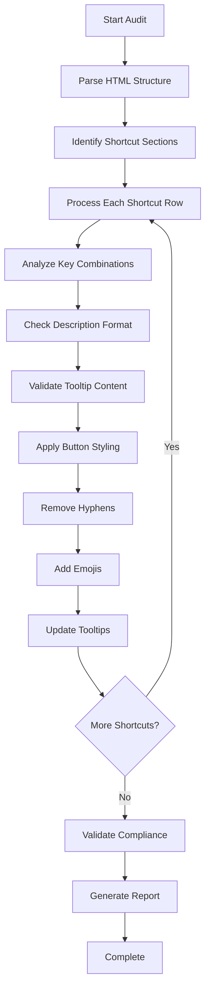

# Keyboard Shortcut Audit and Standardization Design

## Overview

This design document outlines the comprehensive audit and standardization process for all keyboard shortcuts in the macOS shortcuts application. The goal is to ensure consistent formatting, styling, and user experience across all 200+ keyboard shortcut entries while maintaining visual hierarchy and accessibility standards.

## Current State Analysis

### Codebase Structure
The application consists of:
- **HTML**: Single-page structure with shortcut groups organized by category
- **CSS**: Comprehensive styling with red/orange button theming and responsive design
- **Shortcut Categories**: System, Finder, Text, Notes, Reminders, Preview, Safari, Terminal
- **Interactive Elements**: Search, filtering, favorites, tooltips, theme switching

### Existing Issues Identified
1. **Inconsistent emoji usage** in descriptions
2. **Trailing periods** present in descriptions and tooltips
3. **Mixed button styling** (some modifier keys using orange instead of red)
4. **Hyphen characters** within and between key combinations
5. **Plain text elements** that should be styled buttons
6. **Inconsistent mouse action formatting**
7. **Missing structured keyboard key representation**

## Standardization Requirements

### 1. Description Enhancement
- **Add appropriate emojis** to all shortcut descriptions for visual hierarchy
- **Remove trailing periods** from all descriptions
- **Maintain consistent emoji patterns** across similar functions

### 2. Tooltip Standardization
- **Remove trailing periods** from all tooltip content
- **Ensure consistent "Контекст:" prefix** formatting
- **Maintain contextual accuracy**

### 3. Button Color Classification

#### Red Buttons (Primary Modifiers)
```css
.symbol-key /* Red gradient styling */
```
- **FN** (🌐 Fn)
- **⌃** (Ctrl/Control)  
- **⌘** (Command)
- **⌥** (Option/Alt)
- **⇧** (Shift)

#### Orange Buttons (Secondary Elements)  
```css
.key /* Orange gradient styling */
```
- **All other keys** (letters, numbers, function keys)
- **Special symbols** (`, ~, /, [, ])
- **Mouse actions** (with 🖱️ prefix)
- **Menu paths** (View > Make Text Bigger/Smaller)

### 4. Character Formatting Rules

#### Hyphen Elimination
- **Remove all hyphens** within key combinations
- **Use spaces** between key elements instead
- **Example**: `⌘-C` → `⌘ C`

#### Unicode Symbol Replacement
- **Arrow text** → Unicode symbols (←↑→↓)
- **"Стрелка влево"** → `←`
- **Special characters** on separate orange buttons

#### Mouse Action Standardization
```html
<kbd class="key">🖱️ Двойной клик</kbd>
<kbd class="key">🖱️ Перетащить иконку на панель избранного</kbd>
<kbd class="key">🖱️ Клик на флажке</kbd>
```

### 5. Menu Path Formatting
```html
<kbd class="key">🖱️ View > Make Text Bigger/Smaller</kbd>
```

## Implementation Architecture

### Audit Process Flow



### Section-by-Section Processing

#### Target Sections for Priority Review
1. **📝 Редактирование текста (универсальные)**
2. **📋 Notes**  
3. **🎯 Reminders**
4. **🖼️ Preview**
5. **🌐 Safari**
6. **💻 Terminal**

#### Processing Pattern
For each shortcut entry:
```html
<div class="shortcut-row">
    <div class="shortcut-keys">[FORMATTED_KEYS]</div>
    <div class="shortcut-description">[EMOJI + DESCRIPTION]</div>
    <div class="favorite-heart" data-tooltip="Контекст: [CONTEXT]">♥</div>
</div>
```

### Key Combination Patterns

#### Standard Modifier + Key
```html
<kbd class="key symbol-key">⌘</kbd> <kbd class="key">C</kbd>
```

#### Multiple Modifiers + Key
```html
<kbd class="key symbol-key">⇧</kbd> <kbd class="key symbol-key">⌘</kbd> <kbd class="key">N</kbd>
```

#### Special Symbols
```html
<kbd class="key symbol-key">⌘</kbd> <kbd class="key">`</kbd>
```

#### Mouse Actions
```html
<kbd class="key">🖱️ Двойной клик на URL</kbd>
```

## Emoji Classification System

### Action Categories
- **✂️** Cut operations
- **📋** Copy operations  
- **📄** New document/file
- **💪** Bold formatting
- **✨** Italic formatting
- **🔍** Search operations
- **🌐** Web/browser actions
- **📸** Screenshot operations
- **🔒** Security/lock operations
- **⬅️➡️↑️↓️** Navigation directions
- **🖱️** Mouse interactions

### Context Categories
- **⚙️** System operations
- **📁** Finder operations
- **📝** Text editing
- **💻** Terminal operations
- **🌐** Safari browser
- **📋** Notes application

## Quality Assurance Framework

### Validation Criteria Checklist

| Criterion | Validation Rule | Example |
|-----------|----------------|---------|
| Emoji Presence | Every description has appropriate emoji | ✂️ Вырезание выделенного объекта |
| No Trailing Periods | Descriptions end without periods | ✂️ Вырезание выделенного объекта |
| Red Modifier Keys | FN, ⌃, ⌘, ⌥, ⇧ use `.symbol-key` class | `<kbd class="key symbol-key">⌘</kbd>` |
| Orange Secondary Keys | Letters, numbers use `.key` class | `<kbd class="key">C</kbd>` |
| No Hyphens | Spaces between key elements | `⌘ C` not `⌘-C` |
| Mouse Action Format | Mouse events with 🖱️ prefix | `🖱️ Двойной клик` |
| Menu Path Format | Complete menu paths on single button | `🖱️ View > Make Text Bigger` |
| Clean Tooltips | No trailing periods in tooltips | `Контекст: Универсальное` |

### Testing Strategy

#### Manual Verification
- **Visual inspection** of each shortcut section
- **Color consistency** verification
- **Emoji appropriateness** review
- **Tooltip accuracy** confirmation

#### Automated Checks
- **HTML structure validation**
- **CSS class consistency**
- **Character pattern matching**
- **Accessibility compliance**

## Implementation Phases

### Phase 1: Core Structure Audit
- Analyze existing HTML structure
- Identify all shortcut entries requiring updates
- Create standardization mapping

### Phase 2: Systematic Updates
- Process each section sequentially
- Apply formatting rules consistently
- Update tooltips and descriptions

### Phase 3: Quality Verification
- Cross-reference against criteria checklist
- Validate visual consistency
- Test responsive behavior

### Phase 4: Final Optimization
- Performance validation
- Accessibility testing
- User experience verification

## Technical Specifications

### CSS Class Structure
```css
/* Red buttons for primary modifiers */
.key.symbol-key {
    background-image: linear-gradient(135deg, #ff6347 0%, #ff4444 50%, #ff6347 100%);
    color: #ff6347;
}

/* Orange buttons for secondary elements */
.key {
    background-image: linear-gradient(135deg, #ff8c00 0%, #ff6b35 50%, #ff8c00 100%);
    color: #ff8c00;
}
```

### HTML Structure Template
```html
<div class="shortcut-row">
    <div class="shortcut-keys">
        <kbd class="key symbol-key">[MODIFIER]</kbd> 
        <kbd class="key">[KEY]</kbd>
    </div>
    <div class="shortcut-description">[EMOJI] [DESCRIPTION]</div>
    <div class="favorite-heart" data-tooltip="Контекст: [CONTEXT]">♥</div>
</div>
```

## Expected Outcomes

### User Experience Improvements
- **Enhanced visual hierarchy** through consistent emoji usage
- **Improved readability** with standardized button styling
- **Better accessibility** through semantic HTML structure
- **Consistent interaction patterns** across all shortcuts

### Maintenance Benefits
- **Standardized codebase** easier to maintain
- **Clear formatting rules** for future additions
- **Automated validation** capability
- **Consistent design language**

### Quality Metrics
- **100% compliance** with formatting criteria
- **Consistent button styling** across all 200+ shortcuts
- **Appropriate emoji usage** for all descriptions
- **Clean tooltip formatting** without trailing periods


