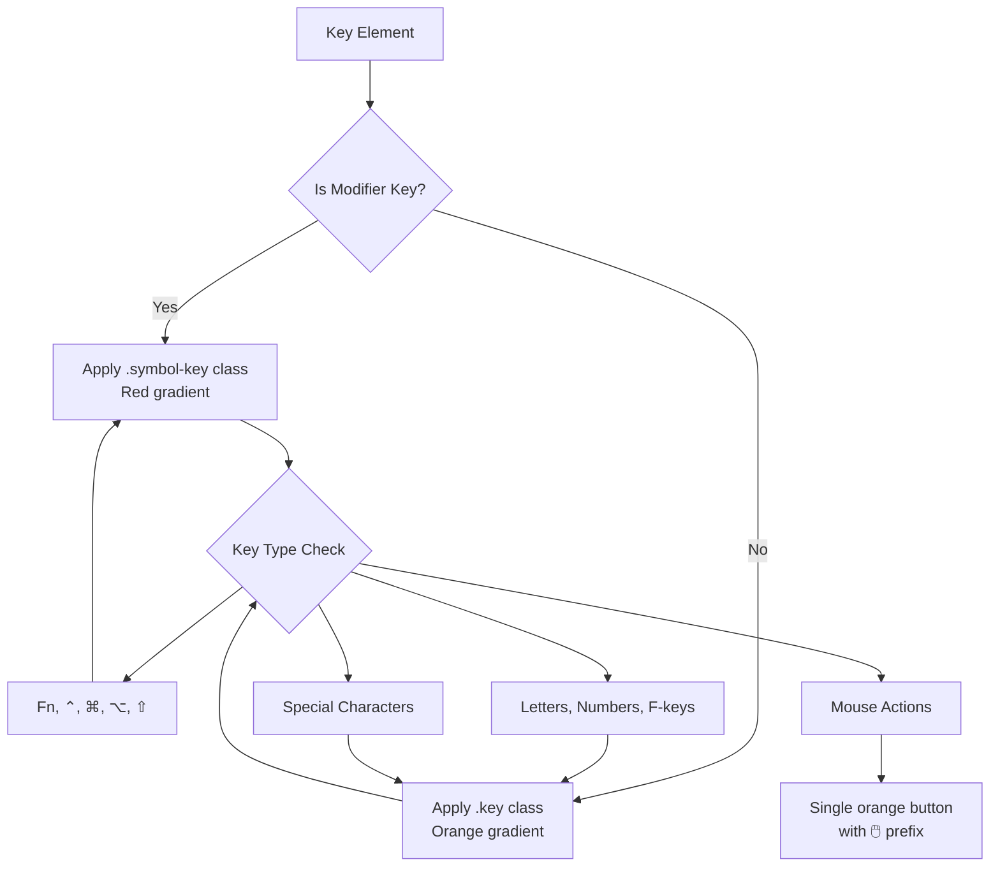
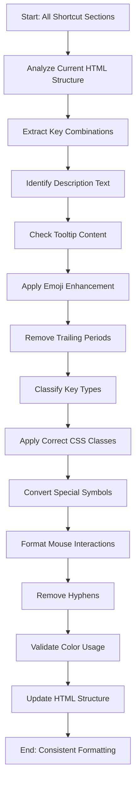

# Keyboard Shortcut Formatting Enhancement Design

## Overview

This design document outlines a comprehensive enhancement to the macOS shortcuts application's keyboard shortcut formatting system. The project involves systematically updating all keyboard shortcuts across all sections to ensure consistency, visual clarity, and adherence to established design patterns.

Based on detailed analysis of the current implementation, this enhancement addresses critical formatting inconsistencies, improves user experience through standardized visual patterns, and ensures maintainable code structure.

## Technology Stack & Dependencies

- **Frontend**: Pure HTML5, CSS3, JavaScript (ES6+)
- **Styling Framework**: Custom CSS with glassmorphism design
- **Typography**: SF Pro Display (primary), Inter (fallback), SF Mono (keys)
- **Icons**: Unicode symbols and emojis for visual enhancement
- **Animation**: CSS animations for matrix background effect
- **Responsive**: Mobile-first design with adaptive layouts

### External Dependencies
- Google Fonts (Inter font family)
- No JavaScript frameworks (vanilla implementation)
- CSS custom properties for theming
- Backdrop-filter for glassmorphism effects

## Current State Analysis

### Existing Keyboard Key Styling System

The application implements two distinct button styles with specific semantic meaning:

#### Red Gradient Buttons (Symbol Keys)
- **Usage**: Modifier keys that change behavior (⌘, ⌥, ⌃, ⇧, Fn)
- **CSS Class**: `.symbol-key`
- **Color Scheme**: Red gradient (#ff6347 → #ff4444)
- **Purpose**: Primary modifier keys with system-level functions
- **Visual Hierarchy**: Higher importance, draws attention

#### Orange Gradient Buttons (Regular Keys)
- **Usage**: Standard keys (letters, numbers, function keys, actions)
- **CSS Class**: `.key`
- **Color Scheme**: Orange gradient (#ff8c00 → #ff6b35)
- **Purpose**: Secondary keys and action keys
- **Visual Hierarchy**: Standard importance, supporting actions

### Critical Issues Identified from Analysis

1. **Inconsistent Hyphen Usage**: Multiple variations found:
   - `⌘-Mission Control или Fn-H` (hyphens present)
   - `⌘-Стрелка вверх` (hyphen with text)
   - `⇧-⌘-Стрелка вверх` (multiple hyphens)
   - `⌘-Точка с запятой (;)` (hyphen in compound keys)

2. **Mixed Mouse Interaction Formatting**:
   - **Correct**: `🖱️ Двойной щелчок с ⌥` (properly formatted)
   - **Incorrect**: `Двойной клик в списке загрузок` (missing 🖱️ and kbd wrapper)
   - **Incorrect**: `⌘-Двойной клик на URL` (hyphen usage)
   - **Incorrect**: `Тройной клик` (missing formatting)

3. **Inconsistent Arrow Key Representation**:
   - **Mixed**: `Fn Стрелка вверх` (text description)
   - **Inconsistent**: `⇧-Стрелка влево` (hyphen with text)
   - **Needs Unicode**: All "Стрелка" text should be replaced with ↑↓←→ symbols

4. **CSS Class Application Issues**:
   - Some `Fn` keys missing `.symbol-key` class
   - Inconsistent modifier key classification
   - Orange text used inappropriately in key descriptions

5. **Tooltip Punctuation**: Some tooltips may have trailing periods

6. **Complex Key Combination Formatting**:
   - `⌥-⇧-Увеличение/Уменьшение яркости клавиатуры` (needs restructuring)
   - `⇧-⌘-Вертикальная черта (|)` (compound description needs simplification)

## Enhancement Requirements

### 1. Description Enhancement
- **Emoji Integration**: Maintain and verify appropriate emojis in all keyboard shortcut descriptions
- **Punctuation Cleanup**: Remove any trailing periods from descriptions
- **Consistency**: Ensure uniform description formatting across all sections
- **Contextual Clarity**: Improve description specificity and usefulness

### 2. Tooltip Standardization
- **Punctuation**: Remove trailing periods from all tooltips
- **Content Structure**: Maintain "Контекст: [context]" format consistently
- **Brevity**: Keep tooltips concise yet informative
- **Context Accuracy**: Ensure context information is precise and helpful

### 3. Key Styling Classification

#### Red Gradient Keys (.symbol-key)
Must be applied to ALL instances of:
- **Fn** (Function key) - Critical fix needed
- **⌃** (Control)
- **⌘** (Command)  
- **⌥** (Option/Alt)
- **⇧** (Shift)

#### Orange Gradient Keys (.key)
Must be applied to:
- All alphabetic keys (A-Z, А-Я)
- All numeric keys (0-9)
- Function keys (F1-F12)
- Special action keys (Space, Enter, Delete, Tab, Esc, etc.)
- Directional keys (Arrow keys as Unicode symbols)
- Punctuation and symbols (-, +, [, ], {, }, |, ;, etc.)
- Hardware keys (Power, Eject, etc.)
- Menu navigation text and system actions

### 4. Hyphen Elimination Strategy

#### Complete Hyphen Removal Required
**Current Problems Found**:
- `⌘-Mission Control` → `<kbd class="key symbol-key">⌘</kbd> <kbd class="key">Mission Control</kbd>`
- `⌘-Стрелка вверх` → `<kbd class="key symbol-key">⌘</kbd> <kbd class="key">↑</kbd>`
- `⇧-⌘-Стрелка вверх` → `<kbd class="key symbol-key">⇧</kbd> <kbd class="key symbol-key">⌘</kbd> <kbd class="key">↑</kbd>`
- `⌘-Точка с запятой (;)` → `<kbd class="key symbol-key">⌘</kbd> <kbd class="key">;</kbd>`

#### Systematic Replacement Pattern
**Rule**: All `[modifier]-[key]` combinations must become separate `<kbd>` elements

```html
<!-- BEFORE: Hyphen format -->
<div class="shortcut-keys">⌘-Стрелка влево</div>

<!-- AFTER: Separate elements -->
<div class="shortcut-keys">
    <kbd class="key symbol-key">⌘</kbd> <kbd class="key">←</kbd>
</div>
```

### 5. Fn Key Classification Fix

**Critical Issue**: Many `Fn` keys are missing `.symbol-key` class

**Required Changes**:
```html
<!-- BEFORE -->
<kbd class="key">Fn</kbd>
<!-- AFTER -->
<kbd class="key symbol-key">Fn</kbd>
```

**Rule**: ALL instances of `Fn` must use `symbol-key` class for red gradient styling

### 6. Unicode Symbol Integration & Text Standardization

#### Directional Keys Conversion
**Pattern**: All instances of "Стрелка [direction]" must be converted:
- "Стрелка влево" → "←"
- "Стрелка вправо" → "→"
- "Стрелка вверх" → "↑"
- "Стрелка вниз" → "↓"

**Examples of Required Changes**:
```html
<!-- BEFORE -->
<kbd class="key">Fn</kbd> <kbd class="key">Стрелка вверх</kbd>
<!-- AFTER -->
<kbd class="key symbol-key">Fn</kbd> <kbd class="key">↑</kbd>
```

#### Complex Key Descriptions
**Simplification Rules**:
- "Левая фигурная скобка ({)" → "{"
- "Правая фигурная скобка (})" → "}"
- "Вертикальная черта (|)" → "|"
- "Точка с запятой (;)" → ";"

#### System Key Descriptions
**Hardware Keys**:
- "⚡ Кнопка питания" → "Power"
- "📀 Извлечение диска" → "Eject"
- "Mission Control" → keep as is
- "Touch ID" references → "Touch ID"

### 7. Mouse Interaction Enhancement

#### Comprehensive Pattern Requirements
All mouse interactions must follow this standardized structure:

**Single Orange Button Format**:
```html
<kbd class="key">🖱️ [Action Description]</kbd>
```

#### Identified Corrections Needed

**Already Correctly Formatted**:
- `🖱️ Двойной щелчок с ⌥` ✓
- `🖱️ Перетаскивание с ⌘` ✓
- `🖱️ ⌘ на заголовке окна` ✓

**Requires Formatting**:
```html
<!-- BEFORE -->
<div class="shortcut-keys">Двойной клик в списке загрузок</div>
<!-- AFTER -->
<div class="shortcut-keys"><kbd class="key">🖱️ Двойной клик в списке загрузок</kbd></div>

<!-- BEFORE -->
<div class="shortcut-keys">Тройной клик</div>
<!-- AFTER -->
<div class="shortcut-keys"><kbd class="key">🖱️ Тройной клик</kbd></div>

<!-- BEFORE -->
<div class="shortcut-keys">⌘-Двойной клик на URL</div>
<!-- AFTER -->
<div class="shortcut-keys"><kbd class="key">🖱️ ⌘ Двойной клик на URL</kbd></div>
```

#### Mouse + Modifier Key Pattern
When mouse actions involve modifier keys:
- Remove hyphens between modifier and action
- Keep 🖱️ prefix
- Use space separation: `🖱️ ⌘ Двойной клик`

### 8. Special Symbol Handling

#### Individual Symbol Buttons
Characters that should get their own orange buttons when used in combinations:
- **Backtick**: `
- **Tilde**: ~
- **Forward Slash**: /
- **Square Brackets**: [ ]
- **Curly Braces**: { }
- **Pipe**: |
- **Semicolon**: ;
- **Comma**: ,
- **Other Punctuation**: As needed for specific shortcuts

## Component Architecture

### HTML Structure Pattern

```html
<div class="shortcut-row">
    <div class="shortcut-keys">
        <kbd class="key symbol-key">⌘</kbd> <kbd class="key">X</kbd>
    </div>
    <div class="shortcut-description">✂️ Вырезание выделенного объекта и копирование в буфер обмена</div>
    <div class="favorite-heart" data-tooltip="Контекст: Универсальное">♥</div>
</div>
```

### CSS Class Application Logic



### Processing Workflow



## Section Coverage

The enhancement must be applied systematically to all existing sections:

### System Shortcuts (⚙️ Системные)
- Core macOS system operations
- Universal shortcuts across applications
- Accessibility features and navigation

### Finder & File System (📁 Finder)
- File management operations
- Navigation shortcuts and view controls
- File manipulation commands and system integration

### Text Editing (📝 Текст)
- Universal text editing shortcuts
- Formatting commands and style controls
- Text selection and manipulation patterns

### Calendar (📅 Calendar)
- Date navigation and view switching
- Event management and creation
- Calendar organization features

### Mail (✉️ Mail)
- Email composition and management
- Navigation shortcuts and workflow
- Folder operations and organization

### Notes (📋 Notes)
- Note creation and editing workflows
- Formatting shortcuts and organization
- Cross-platform synchronization features

### Safari (🌐 Safari)
- Web browsing shortcuts and navigation
- Tab management and bookmark operations
- Developer and accessibility features

### Spotlight (🔍 Spotlight)
- Search functionality and indexing
- Result navigation and quick actions
- System-wide search integration

### Terminal (💻 Terminal)
- Command line operations and navigation
- Window and tab management
- Text manipulation in terminal environment

## Quality Assurance & Validation

### Validation Criteria

1. **Visual Consistency**: All modifier keys use red gradient styling (`.symbol-key`)
2. **Color Compliance**: No orange text except for conjunctions ("или", "or")
3. **Symbol Accuracy**: Proper Unicode symbols for directional keys (↑↓←→)
4. **Mouse Action Format**: All mouse interactions properly formatted with 🖱️
5. **Punctuation**: No trailing periods in descriptions or tooltips
6. **Emoji Presence**: Appropriate emojis maintained in all descriptions
7. **Hyphen Elimination**: No hyphens within or between key combinations
8. **CSS Class Accuracy**: Correct classification of all keyboard elements

### Testing Checklist

- [ ] All Fn, ⌃, ⌘, ⌥, ⇧ keys use `.symbol-key` class
- [ ] All other keys use `.key` class consistently
- [ ] No trailing periods in descriptions
- [ ] No trailing periods in tooltips
- [ ] Appropriate emojis maintained in descriptions
- [ ] No hyphens in key combinations
- [ ] No orange text except approved conjunctions
- [ ] Mouse actions formatted with 🖱️ prefix
- [ ] Special symbols properly represented as individual buttons
- [ ] Unicode arrows replace all "Стрелка" text descriptions
- [ ] Complex key descriptions simplified appropriately
- [ ] Tooltip context information accurate and helpful

### Browser Compatibility
- **Primary**: Safari (macOS native)
- **Secondary**: Chrome, Firefox, Edge
- **Mobile**: iOS Safari, Android Chrome
- **Testing**: Cross-browser validation required

### Performance Considerations
- **CSS Optimization**: Minimize redundant styles
- **Font Loading**: Optimize web font delivery
- **Animation Performance**: Ensure smooth 60fps animations
- **Mobile Responsiveness**: Touch-friendly interactions

## Implementation Impact

### Benefits
- **Enhanced Usability**: Clear visual hierarchy between modifier and action keys
- **Improved Accessibility**: Consistent styling aids recognition and screen readers
- **Better Aesthetics**: Uniform emoji usage and professional formatting
- **Cleaner Interface**: Elimination of visual inconsistencies and confusion
- **Better User Experience**: Standardized interaction patterns reduce learning curve
- **Maintainable Code**: Consistent structure facilitates future updates

### Risk Mitigation
- **Backup Strategy**: Maintain original file structure during updates
- **Incremental Updates**: Process sections systematically to avoid overwhelming changes
- **Validation Testing**: Test each section after updates to ensure functionality
- **Rollback Plan**: Ability to revert changes if issues arise
- **Cross-platform Testing**: Verify consistency across different devices and browsers

### Performance Impact
- **Minimal CSS Changes**: No significant performance impact expected
- **Font Loading**: Existing font stack maintained
- **Animation Compatibility**: No changes to existing animations
- **Mobile Optimization**: Improved touch interaction patterns

This comprehensive enhancement will transform the keyboard shortcuts interface into a more professional, consistent, and user-friendly experience while maintaining the existing functionality and design aesthetic. The systematic approach ensures quality, maintainability, and enhanced user experience across all supported platforms.