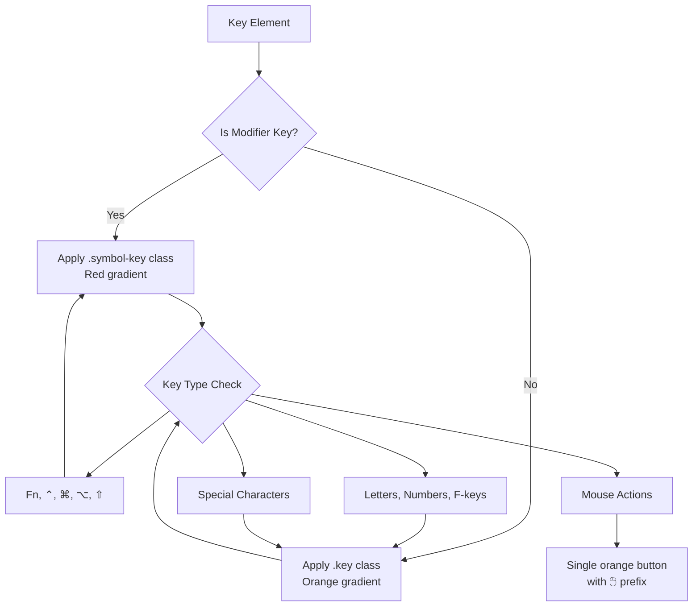
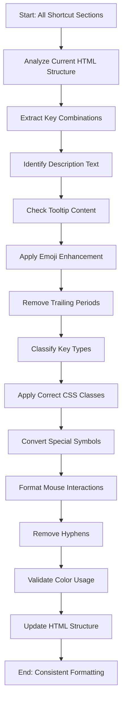

# Keyboard Shortcut Formatting Enhancement Design

## Overview

This design document outlines a comprehensive enhancement to the macOS shortcuts application's keyboard shortcut formatting system. The project involves systematically updating all keyboard shortcuts across all sections to ensure consistency, visual clarity, and adherence to established design patterns.

## Technology Stack

- **Frontend**: Pure HTML5, CSS3, JavaScript (ES6+)
- **Styling Framework**: Custom CSS with glassmorphism design
- **Fonts**: SF Pro Display (primary), Inter (fallback)
- **Icons**: Unicode symbols and emojis
- **Animation**: CSS animations for matrix background

## Current State Analysis

### Existing Keyboard Key Styling System

The application currently implements two distinct button styles:

#### Red Gradient Buttons (Symbol Keys)
- **Usage**: Modifier keys (⌘, ⌥, ⌃, ⇧, Fn)
- **CSS Class**: `.symbol-key`
- **Color Scheme**: Red gradient (#ff6347 → #ff4444)
- **Purpose**: Primary modifier keys that change the behavior of other keys

#### Orange Gradient Buttons (Regular Keys)
- **Usage**: Standard keys (letters, numbers, function keys)
- **CSS Class**: `.key`
- **Color Scheme**: Orange gradient (#ff8c00 → #ff6b35)
- **Purpose**: Secondary keys and action keys

### Current Issues Identified

1. **Inconsistent Key Styling**: Some modifier keys use orange instead of red styling
2. **Inconsistent Punctuation**: Missing periods in descriptions, inconsistent tooltip formatting
3. **Missing Visual Enhancement**: Lack of emojis in descriptions for better visual identification
4. **Hyphen Usage**: Presence of hyphens within and between key combinations
5. **Text Formatting**: Orange text used inappropriately in key combinations
6. **Special Character Handling**: Inconsistent representation of directional keys and special symbols
7. **Mouse Interaction Formatting**: Mouse clicks and drag operations not properly formatted with visual indicators

## Enhancement Requirements

### 1. Description Enhancement
- **Emoji Integration**: Add appropriate emojis to all keyboard shortcut descriptions
- **Punctuation Cleanup**: Remove trailing periods from descriptions
- **Consistency**: Ensure uniform description formatting across all sections

### 2. Tooltip Standardization
- **Punctuation**: Remove trailing periods from all tooltips
- **Content Structure**: Maintain "Context: [context]" format
- **Brevity**: Keep tooltips concise and informative

### 3. Key Styling Classification

#### Red Gradient Keys (.symbol-key)
Must be applied to:
- **Fn** (Function key)
- **⌃** (Control)
- **⌘** (Command)
- **⌥** (Option/Alt)
- **⇧** (Shift)

#### Orange Gradient Keys (.key)
Must be applied to:
- All alphabetic keys (A-Z, А-Я)
- All numeric keys (0-9)
- Function keys (F1-F12)
- Special action keys (Space, Enter, Delete, etc.)
- Directional keys (Arrow keys)
- Punctuation and symbols (-, +, [, ], etc.)
- Menu navigation text

### 4. Hyphen Elimination
- **Within Keys**: Remove hyphens inside individual key elements
- **Between Keys**: Replace hyphens with spaces between key combinations
- **Text Processing**: Ensure clean separation without connecting characters

### 5. Text Color Management
- **Eliminate Orange Text**: Remove any orange-colored text from key combinations
- **Exception**: Preserve orange text for prepositions ("с", "или", "or")
- **Button-Only Approach**: All interactive elements should be buttons, not colored text

### 6. Unicode Symbol Integration

#### Directional Keys
- Replace "Стрелка влево" with "←" symbol
- Replace "Стрелка вправо" with "→" symbol  
- Replace "Стрелка вверх" with "↑" symbol
- Replace "Стрелка вниз" with "↓" symbol

#### Special Characters
- Consolidate punctuation like "Минус (-)" into single button: "-"
- Handle menu paths like "View > Make Text Bigger/Smaller" as single orange button

### 7. Mouse Interaction Enhancement

#### Formatting Pattern
All mouse interactions must follow this structure:
- **Single Orange Button**: Contains entire mouse action
- **Emoji Prefix**: 🖱️ at the beginning
- **Action Description**: Clear description of the mouse action

#### Examples
- "Клик на флажке" → `<kbd class="key">🖱️ Клик на флажке</kbd>`
- "Двойной клик в списке" → `<kbd class="key">🖱️ Двойной клик в списке</kbd>`
- "Перетащить файл" → `<kbd class="key">🖱️ Перетащить файл</kbd>`

### 8. Special Symbol Handling

#### Individual Symbol Buttons
Characters that should get their own orange buttons when used in combinations:
- **Backtick**: `
- **Tilde**: ~
- **Forward Slash**: /
- **Square Brackets**: [ ]
- **Other Punctuation**: As needed for specific shortcuts

## Implementation Architecture

### HTML Structure Pattern

```html
<div class="shortcut-row">
    <div class="shortcut-keys">
        <kbd class="key symbol-key">⌘</kbd> <kbd class="key">X</kbd>
    </div>
    <div class="shortcut-description">✂️ Вырезание выделенного объекта и копирование в буфер обмена</div>
    <div class="favorite-heart" data-tooltip="Добавить в избранное">♥</div>
</div>
```

### CSS Class Application Logic


```mermaid
flowchart TD
    A[Key Element] --> B{Is Modifier Key?}
    B -->|Yes| C[Apply .symbol-key class<br/>Red gradient]
    B -->|No| D[Apply .key class<br/>Orange gradient]
    
    C --> E{Key Type Check}
    D --> E
    
    E --> F[Fn, ⌃, ⌘, ⌥, ⇧]
    E --> G[Letters, Numbers, F-keys]
    E --> H[Special Characters]
    E --> I[Mouse Actions]
    
    F --> C
    G --> D
    H --> D
    I --> J[Single orange button<br/>with 🖱️ prefix]
```

### Processing Workflow


```mermaid
flowchart TD
    A[Start: All Shortcut Sections] --> B[Analyze Current HTML Structure]
    B --> C[Extract Key Combinations]
    C --> D[Identify Description Text]
    D --> E[Check Tooltip Content]
    
    E --> F[Apply Emoji Enhancement]
    F --> G[Remove Trailing Periods]
    G --> H[Classify Key Types]
    H --> I[Apply Correct CSS Classes]
    I --> J[Convert Special Symbols]
    J --> K[Format Mouse Interactions]
    K --> L[Remove Hyphens]
    L --> M[Validate Color Usage]
    M --> N[Update HTML Structure]
    N --> O[End: Consistent Formatting]
```

## Section Coverage

The enhancement must be applied to all existing sections:

### System Shortcuts (⚙️ Системные)
- Core macOS system operations
- Universal shortcuts across applications
- Accessibility features

### Finder & File System (📁 Finder)
- File management operations
- Navigation shortcuts
- File manipulation commands

### Text Editing (📝 Текст)
- Universal text editing shortcuts
- Formatting commands
- Text selection and manipulation

### Calendar (📅 Calendar)
- Date navigation
- Event management
- View switching

### Mail (✉️ Mail)
- Email composition and management
- Navigation shortcuts
- Folder operations

### Notes (📋 Notes)
- Note creation and editing
- Formatting shortcuts
- Organization features

### Safari (🌐 Safari)
- Web browsing shortcuts
- Tab management
- Bookmark operations

### Spotlight (🔍 Spotlight)
- Search functionality
- Result navigation
- Quick actions

### Terminal (💻 Terminal)
- Command line operations
- Window and tab management
- Text manipulation in terminal

## Quality Assurance

### Validation Criteria

1. **Visual Consistency**: All modifier keys use red gradient styling
2. **Color Compliance**: No orange text except for prepositions
3. **Symbol Accuracy**: Proper Unicode symbols for directional keys
4. **Mouse Action Format**: All mouse interactions properly formatted with 🖱️
5. **Punctuation**: No trailing periods in descriptions or tooltips
6. **Emoji Presence**: Appropriate emojis in all descriptions
7. **Hyphen Elimination**: No hyphens within or between key combinations

### Testing Checklist

- [ ] All Fn, ⌃, ⌘, ⌥, ⇧ keys use `.symbol-key` class
- [ ] All other keys use `.key` class  
- [ ] No trailing periods in descriptions
- [ ] No trailing periods in tooltips
- [ ] Appropriate emojis added to descriptions
- [ ] No hyphens in key combinations
- [ ] No orange text except prepositions
- [ ] Mouse actions formatted with 🖱️ prefix
- [ ] Special symbols properly represented
- [ ] Unicode arrows replace text descriptions

## Implementation Impact

### Benefits
- **Enhanced Usability**: Clear visual hierarchy between modifier and action keys
- **Improved Accessibility**: Consistent styling aids recognition
- **Better Aesthetics**: Uniform emoji usage and formatting
- **Cleaner Interface**: Elimination of visual inconsistencies
- **Better User Experience**: Standardized interaction patterns

### Risk Mitigation
- **Backup Strategy**: Maintain original file structure during updates
- **Incremental Updates**: Process sections systematically to avoid overwhelming changes
- **Validation**: Test each section after updates to ensure functionality
- **Rollback Plan**: Ability to revert changes if issues arise

This comprehensive enhancement will transform the keyboard shortcuts interface into a more professional, consistent, and user-friendly experience while maintaining the existing functionality and design aesthetic.