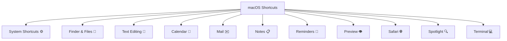
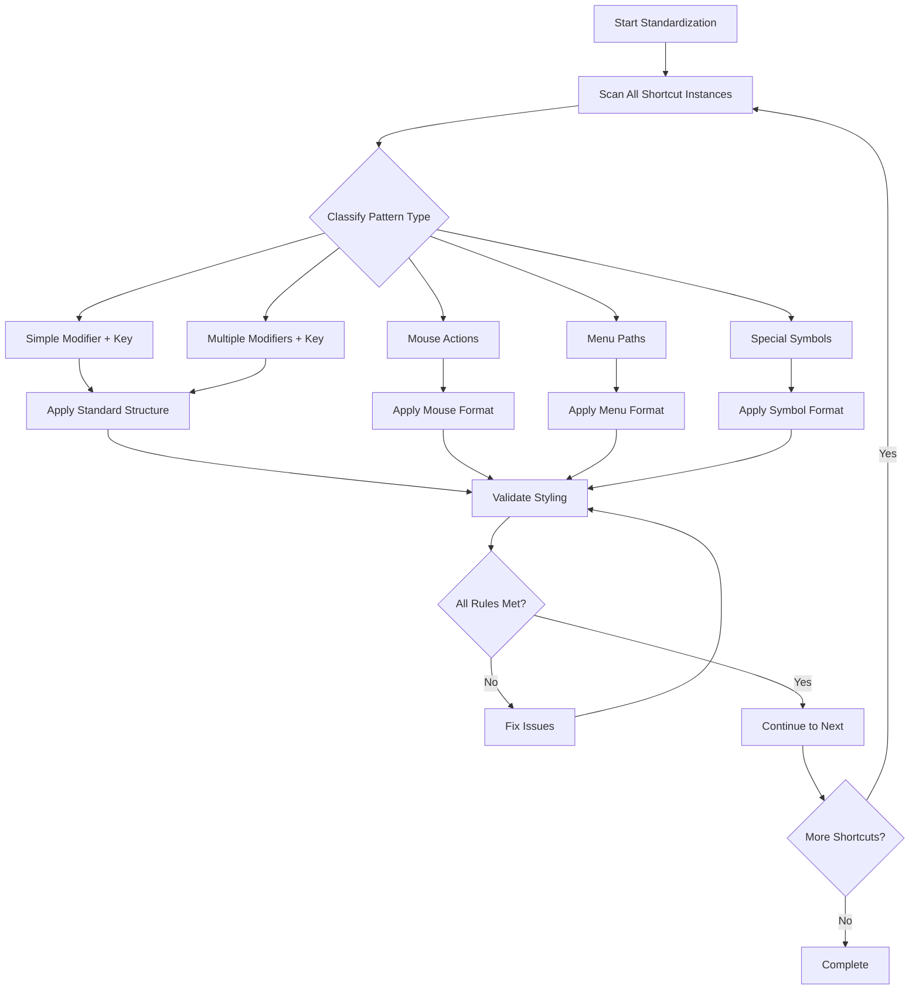
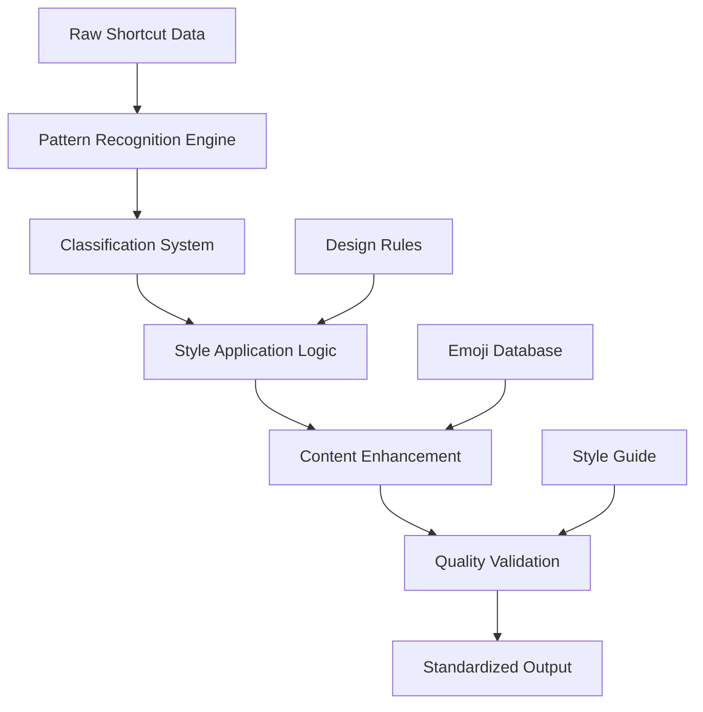

# macOS Keyboard Shortcuts Standardization Review

## Overview

This design document provides a comprehensive analysis and standardization plan for the macOS keyboard shortcuts project. The current implementation contains over 3900 lines of shortcuts across multiple application categories, with significant formatting inconsistencies that need to be addressed to meet established design criteria.

## Current Analysis

### Project Structure

The project consists of two main files:
- `index.html`: Contains the keyboard shortcut entries organized in sections
- `styles.css`: Provides comprehensive styling for keyboard shortcuts with proper visual hierarchy

### Existing Categories


```mermaid
graph TD
    A[macOS Shortcuts] --> B[System Shortcuts ⚙️]
    A --> C[Finder & Files 📁]
    A --> D[Text Editing 📝]
    A --> E[Calendar 📅]
    A --> F[Mail ✉️]
    A --> G[Notes 📋]
    A --> H[Reminders 📌]
    A --> I[Preview 👁️]
    A --> J[Safari 🌐]
    A --> K[Spotlight 🔍]
    A --> L[Terminal 💻]
```

### Current Formatting Issues Identified

#### 1. Inconsistent Button Styling
- **Problem**: Some modifier keys (⌘⌥⌃⇧Fn) use orange styling instead of required red
- **Impact**: Visual hierarchy confusion, inconsistent with design specifications
- **Example**: `<kbd class="key">⌘</kbd>` should be `<kbd class="key symbol-key">⌘</kbd>`

#### 2. Hyphen Usage in Shortcuts
- **Problem**: Many shortcuts contain hyphens between keys
- **Impact**: Violates design rule #5 (no hyphens within or between keys)
- **Examples**: 
  - `⌃-A` should be structured as separate `<kbd>` elements
  - `⌥-⌘-T` should be `<kbd class="key symbol-key">⌥</kbd> <kbd class="key symbol-key">⌘</kbd> <kbd class="key">T</kbd>`

#### 3. Missing Emoji in Descriptions
- **Problem**: Many descriptions lack appropriate emoji prefixes
- **Impact**: Reduces visual scanning efficiency and user engagement
- **Examples**: 
  - "Копирование выделенного объекта" → "📋 Копирование выделенного объекта"

#### 4. Trailing Periods in Descriptions and Tooltips
- **Problem**: Inconsistent use of periods at end of descriptions and tooltips
- **Impact**: Visual clutter, inconsistent formatting
- **Examples**: 
  - "Контекст: Finder." → "Контекст: Finder"

#### 5. Unstructured Text Elements
- **Problem**: Text descriptions of keys not properly wrapped in `<kbd>` elements
- **Impact**: Poor accessibility, inconsistent styling
- **Examples**: 
  - "Стрелка влево" → `<kbd class="key">←</kbd>`
  - Menu paths need orange button treatment

#### 6. Mouse Action Formatting
- **Problem**: Mouse-related actions not properly formatted with 🖱️ prefix
- **Impact**: Inconsistent visual treatment of interaction types
- **Examples**: 
  - "Клик на флажке" → `<kbd class="key">🖱️ Клик на флажке</kbd>`

#### 7. Special Character Button Treatment
- **Problem**: Symbols like ` ~ / [ ] not properly styled as orange buttons
- **Impact**: Inconsistent keyboard representation
- **Examples**: 
  - "`" should be `<kbd class="key">`</kbd>`

## Standardization Requirements

### 1. Color Classification System

```mermaid
graph LR
    A[Button Colors] --> B[Red - Primary Modifiers]
    A --> C[Orange - Secondary Keys]
    
    B --> D[Fn 🌐]
    B --> E[⌃ Ctrl]
    B --> F[⌥ Option] 
    B --> G[⇧ Shift]
    B --> H[⌘ Command]
    
    C --> I[Letter Keys A-Z]
    C --> J[Number Keys 0-9]
    C --> K[Function Keys F1-F12]
    C --> L[Special Symbols ` ~ / [ ]]
    C --> M[Mouse Actions 🖱️]
    C --> N[Menu Paths]
```

### 2. Structural Requirements

#### Proper HTML Structure
```html
<!-- Correct Structure -->
<div class="shortcut-row">
    <div class="shortcut-keys">
        <kbd class="key symbol-key">⌘</kbd> <kbd class="key">C</kbd>
    </div>
    <div class="shortcut-description">📋 Копирование выделенного объекта в буфер обмена</div>
    <div class="favorite-heart" data-tooltip="Контекст: Универсальное">♥</div>
</div>

<!-- Mouse Action Structure -->
<div class="shortcut-keys">
    <kbd class="key symbol-key">⌘</kbd> <kbd class="key">🖱️ Клик на флажке</kbd>
</div>

<!-- Menu Path Structure -->
<div class="shortcut-keys">
    <kbd class="key symbol-key">⌥</kbd> <kbd class="key">View > Make Text Bigger</kbd>
</div>
```

### 3. Typography and Symbol Standards

#### Emoji Usage Guidelines
- **System Actions**: ⚙️🔒🔄⚡💻
- **File Operations**: 📁📄📋💾🗂️
- **Navigation**: 🔍🔄➡️⬅️⬆️⬇️
- **Visual**: 👁️🎨🖥️📸✨
- **Communication**: ✉️📅📌📋
- **Input**: ✂️📎🖨️⌨️🖱️

#### Unicode Arrow Replacements
- "Стрелка влево" → `←`
- "Стрелка вправо" → `→`
- "Стрелка вверх" → `↑`
- "Стрелка вниз" → `↓`

## Architecture of Standardization Process

### Phase 1: Pattern Analysis and Classification


```mermaid
flowchart TD
    A[Start Standardization] --> B[Scan All Shortcut Instances]
    B --> C{Classify Pattern Type}
    
    C --> D[Simple Modifier + Key]
    C --> E[Multiple Modifiers + Key]
    C --> F[Mouse Actions]
    C --> G[Menu Paths]
    C --> H[Special Symbols]
    
    D --> I[Apply Standard Structure]
    E --> I
    F --> J[Apply Mouse Format]
    G --> K[Apply Menu Format]
    H --> L[Apply Symbol Format]
    
    I --> M[Validate Styling]
    J --> M
    K --> M
    L --> M
    
    M --> N{All Rules Met?}
    N -->|No| O[Fix Issues]
    N -->|Yes| P[Continue to Next]
    
    O --> M
    P --> Q{More Shortcuts?}
    Q -->|Yes| B
    Q -->|No| R[Complete]
```

### Phase 2: Content Enhancement

#### Emoji Assignment Strategy
1. **Contextual Analysis**: Determine action type (copy, paste, navigate, etc.)
2. **Visual Hierarchy**: Ensure emoji supports quick visual scanning
3. **Consistency**: Use same emoji for similar actions across categories
4. **Cultural Appropriateness**: Select universally understood symbols

#### Description Optimization
- Remove trailing periods consistently
- Ensure concise yet descriptive text
- Maintain Russian language conventions
- Standardize terminology across sections

### Phase 3: Tooltip Standardization

#### Format Requirements
- **Structure**: "Контекст: [context description]"
- **No Periods**: Remove trailing punctuation
- **Conciseness**: Keep under 100 characters when possible
- **Contextual Value**: Provide additional usage information

## Component Integration

### Keyboard Key Styling System

The existing CSS architecture supports the required standardization:

#### Red Keys (Primary Modifiers)
```css
.symbol-key {
    background: linear-gradient(135deg, #2a2a2a 0%, #1a1a1a 50%, #2a2a2a 100%);
    background-image: linear-gradient(135deg, #ff6347 0%, #ff4444 50%, #ff6347 100%);
    color: #ff6347;
    border: 2px solid transparent;
}
```

#### Orange Keys (Secondary Elements)
```css
.key {
    background-image: linear-gradient(135deg, #ff8c00 0%, #ff6b35 50%, #ff8c00 100%);
    color: #ff8c00;
    border: 2px solid transparent;
}
```

### Responsive Design Considerations

The standardization must maintain compatibility with existing responsive breakpoints:
- **Desktop**: Full shortcut display with tooltips
- **Tablet (≤768px)**: Simplified tooltips, maintained structure
- **Mobile (≤480px)**: Compact display, essential information only

## Data Flow Architecture


```mermaid
graph TD
    A[Raw Shortcut Data] --> B[Pattern Recognition Engine]
    B --> C[Classification System]
    C --> D[Style Application Logic]
    D --> E[Content Enhancement]
    E --> F[Quality Validation]
    F --> G[Standardized Output]
    
    H[Design Rules] --> D
    I[Emoji Database] --> E
    J[Style Guide] --> F
```

## Testing Strategy

### Validation Criteria Checklist

#### Visual Compliance
- [ ] All primary modifiers (Fn, ⌃, ⌘, ⌥, ⇧) use red styling
- [ ] All secondary keys use orange styling
- [ ] No hyphens between or within keys
- [ ] Proper `<kbd>` element structure

#### Content Standards
- [ ] All descriptions have appropriate emoji prefixes
- [ ] No trailing periods in descriptions
- [ ] No trailing periods in tooltips
- [ ] Mouse actions prefixed with 🖱️
- [ ] Menu paths in single orange buttons

#### Accessibility
- [ ] Semantic HTML structure maintained
- [ ] Screen reader compatibility
- [ ] Keyboard navigation support
- [ ] High contrast compliance

### Performance Considerations

#### Rendering Optimization
- **CSS Specificity**: Maintain efficient selector hierarchy
- **Font Loading**: Ensure SF Pro Display availability for symbols
- **Animation Performance**: Preserve existing hover effects
- **Mobile Performance**: Optimize for touch interactions

## Risk Assessment

### Potential Issues

#### High Priority
1. **Breaking Changes**: Structural modifications could affect JavaScript functionality
2. **Performance Impact**: Mass HTML changes might affect load times
3. **Accessibility Regression**: Improper HTML structure could hurt screen readers

#### Medium Priority
1. **Visual Consistency**: Ensure changes don't conflict with existing themes
2. **Cross-Browser Compatibility**: Verify symbol rendering across browsers
3. **Mobile Experience**: Maintain usability on small screens

#### Mitigation Strategies
- **Incremental Testing**: Validate changes section by section
- **Backup Strategy**: Maintain current version during transition
- **User Testing**: Verify accessibility improvements
- **Performance Monitoring**: Track load time impact

## Implementation Phases

### Phase 1: Foundation (Structural Fixes)
- Fix hyphen issues in keyboard shortcuts
- Correct modifier key styling (red vs orange)
- Standardize HTML structure

### Phase 2: Content Enhancement
- Add appropriate emojis to all descriptions
- Remove trailing periods from descriptions and tooltips
- Convert text key descriptions to proper symbols

### Phase 3: Special Cases
- Implement mouse action formatting
- Standardize menu path representation
- Handle special character buttons

### Phase 4: Quality Assurance
- Cross-browser testing
- Accessibility validation
- Performance optimization
- User acceptance testing

## Success Metrics

### Quantitative Measures
- **Consistency Score**: 100% compliance with all 9 standardization rules
- **Performance**: No regression in page load times
- **Accessibility**: WCAG 2.1 AA compliance maintained
- **Browser Support**: Consistent rendering across modern browsers

### Qualitative Measures
- **Visual Hierarchy**: Clear distinction between modifier and regular keys
- **Scanability**: Improved visual scanning through consistent emoji usage
- **User Experience**: Enhanced tooltip information value
- **Professional Appearance**: Consistent, polished visual presentation

This standardization effort will transform the keyboard shortcuts reference into a cohesive, professional, and highly usable resource that maintains the existing functionality while dramatically improving visual consistency and user experience.